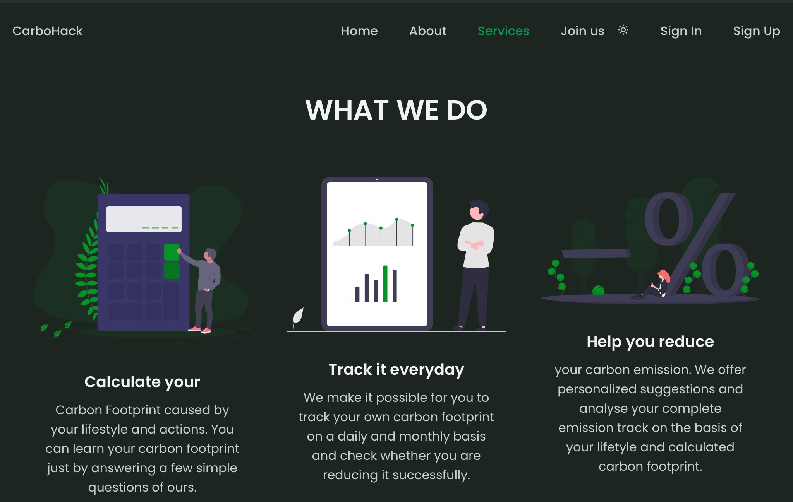
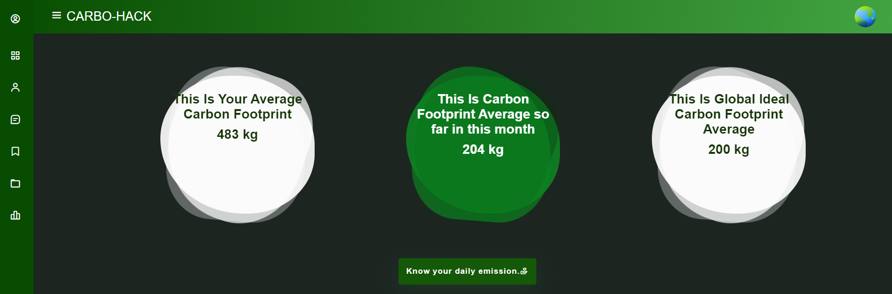
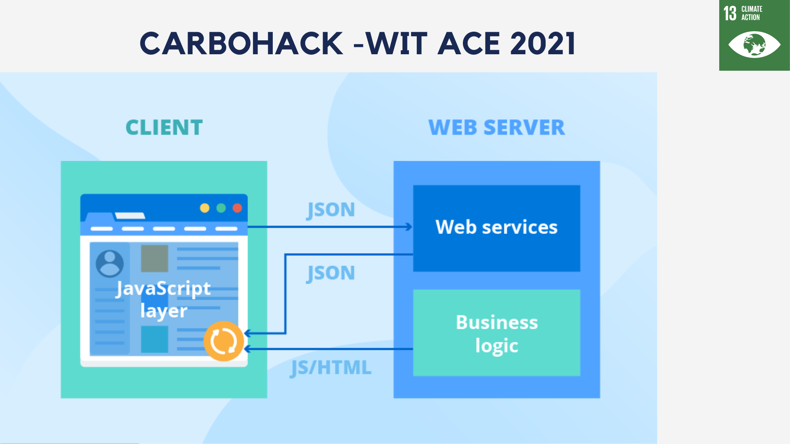
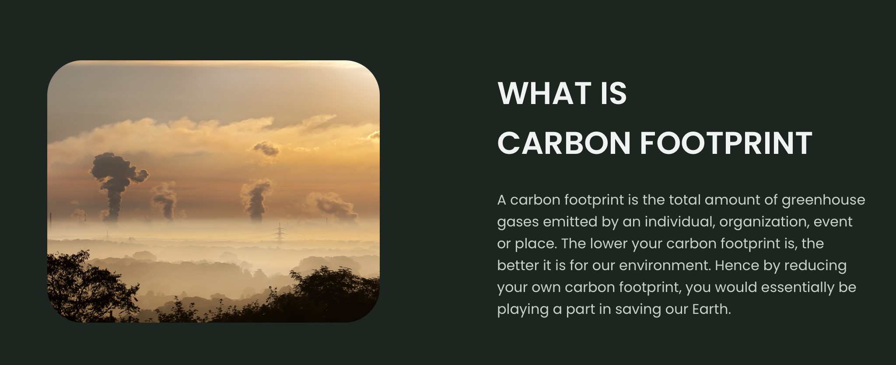
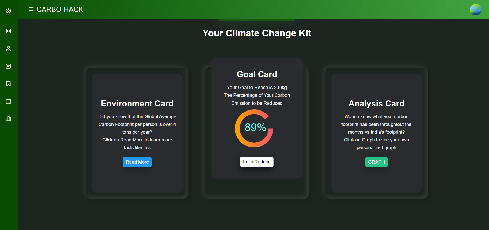
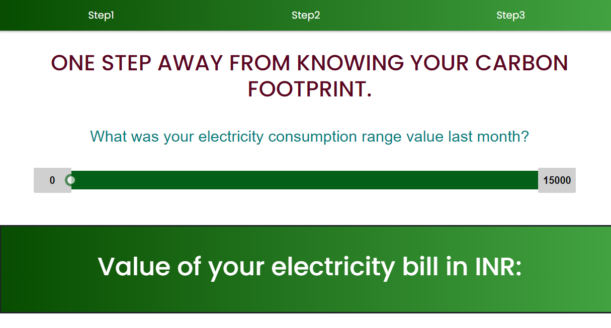
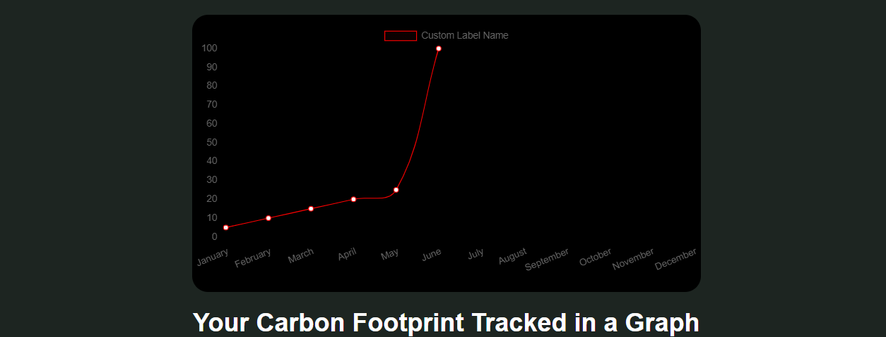
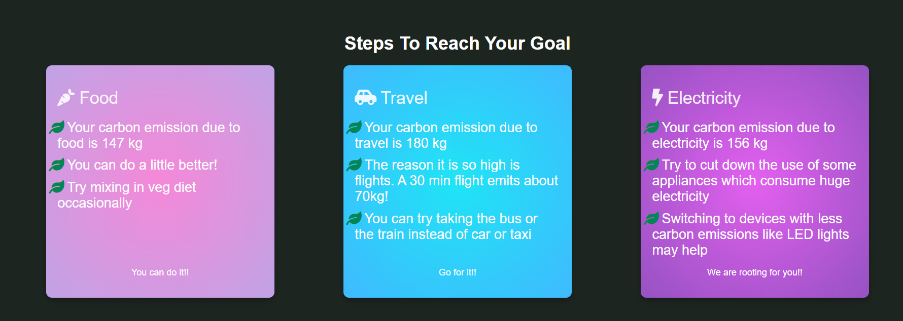
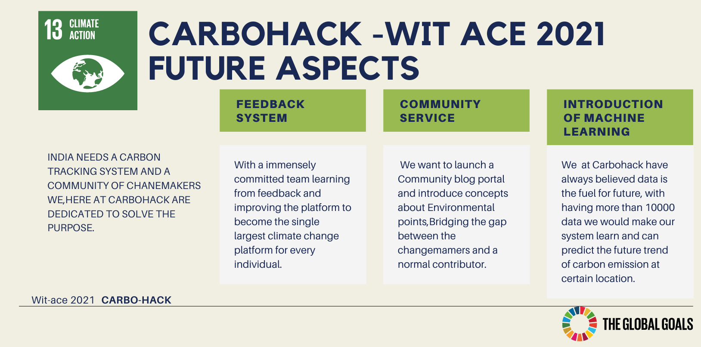

# CARBOHACK-TRACK YOUR CARBON FOOTPRINT

**CARBOHACK- Web Application meant to calculate and track your carbon footprint and provide you suggestions on how to reduce it.**

## Contents

  - [Short Description](#short-description)
    - [What is the problem?](#what-is-the-problem)
    - [How we plan to help?](#how-we-plan-to-help)
    - [The idea](#the-idea)
  - [Demo video](#demo-video)
  - [The Architecture](#the-architecture)
  - [Long Description](#long-description)
    - [What is Carbon Footprint and why does it matter?](#what-is-carbon-footprint-and-why-does-it-matter)
    - [How does CarboHack accomplish that task?](#how-does-carboHack-accomplish-that-task)
  - [Solution Roadmap](#solution-roadmap)
    - [What does CarboHack currently do?](#what-does-carboHack-currently-do)
    - [What more will CarboHack do in the future?](#what-more-will-carboHack-do-in-the-future)
  - [The Team](#team)
  
  
<!-- <h3 align="left">Connect with me:</h3>

 -->
<!-- 
<h3 align="left">Languages and Tools:</h3>

        
 -->

## DEMO VIDEO:

### Watch the video here: https://youtu.be/UdkeWFFWnTg

## PROJECT IS LIVE AT:

### live here: www.carbohack.tech

# Skills involve:

###  Development:

| ![Javascript_logo] | ![HTML_5] |  ![CSS_logo] | ![NodeJS_logo] | 
|  ![Bootstrap]    |  
### Databases:

 ![MongoDB_logo] 
  
  
  
  

[Tensorflow_logo]:https://camo.githubusercontent.com/4058e4719e56be216f2464f47def2f62540a0775acfde94a782f4e1aa9607db7/68747470733a2f2f696d672e736869656c64732e696f2f62616467652f54656e736f72466c6f772532302d2532334646364630302e7376673f267374796c653d666f722d7468652d6261646765266c6f676f3d54656e736f72466c6f77266c6f676f436f6c6f723d7768697465

[Pandas_logo]:https://camo.githubusercontent.com/c7b7cc7ee69f29e63d868190f2c26df123e4a5cdd2b87c7da409397bfd64020c/68747470733a2f2f696d672e736869656c64732e696f2f62616467652f70616e6461732532302d2532333135303435382e7376673f267374796c653d666f722d7468652d6261646765266c6f676f3d70616e646173266c6f676f436f6c6f723d7768697465

[Numpy_logo]:https://camo.githubusercontent.com/98fb748d78c124f0aad277f2f162b0cb4fdb1c3b8f69293bb363ebf44ad557cf/68747470733a2f2f696d672e736869656c64732e696f2f62616467652f6e756d70792532302d2532333031333234332e7376673f267374796c653d666f722d7468652d6261646765266c6f676f3d6e756d7079266c6f676f436f6c6f723d7768697465    

[Python_logo]:https://img.shields.io/badge/Python-3776AB?style=for-the-badge&logo=python&logoColor=white

[C_logo]:https://img.shields.io/badge/C-00599C?style=for-the-badge&logo=c&logoColor=white

[Cpp_logo]:https://img.shields.io/badge/C%2B%2B-00599C?style=for-the-badge&logo=c%2B%2B&logoColor=white

[Java_logo]:https://img.shields.io/badge/Java-5C1F87?style=for-the-badge&logo=java&logoColor=white

[R_logo]:https://img.shields.io/badge/R-276DC3?style=for-the-badge&logo=r&logoColor=white

[Javascript_logo]:https://img.shields.io/badge/JavaScript-F7DF1E?style=for-the-badge&logo=javascript&logoColor=black

[HTML_5]:https://img.shields.io/badge/HTML5-E34F26?style=for-the-badge&logo=html5&logoColor=white

[CSS_logo]:https://img.shields.io/badge/CSS-239120?&style=for-the-badge&logo=css3&logoColor=white

[NodeJS_logo]:https://img.shields.io/badge/NodeJS-3776AB?style=for-the-badge&logo=nodedotjs&logoColor=green

[Bootstrap]:https://img.shields.io/badge/Bootstrap-FFD000?style=for-the-badge&logo=bootstrap&logoColor=purple

[Flask_logo]:https://img.shields.io/badge/Flask-000000?style=for-the-badge&logo=flask&logoColor=white

[React_logo]:https://img.shields.io/badge/React-0B2343?style=for-the-badge&logo=createreactapp&logoColor=white

[PostgresSQL]:https://img.shields.io/badge/PostgreSQL-316192?style=for-the-badge&logo=postgresql&logoColor=white

[MySQl_logo]:https://user-images.githubusercontent.com/52605586/124901352-8ff84880-dfff-11eb-9c42-fcc089908f9a.png

[Oracle_logo]:https://user-images.githubusercontent.com/52605586/124901526-b7e7ac00-dfff-11eb-8917-566f99b4c37c.png

[MongoDB_logo]:https://img.shields.io/badge/MongoDB-FC4C02?style=for-the-badge&logo=mongodb&logoColor=green

  
  
  
<h3 align="left">Languages and Tech Stack used:</h3>

## SHORT DESCRIPTION:

### *What is the problem?*

The world’s Carbon Footprint (i.e., greenhouse gas emissions) have detrimental effects on the environment and on all life on Earth – the most notable of which is the melting of the ice caps and the looming threat of the world going under water. Plus, what’s even more deadly is people’s lack of awareness on how much they are aiding the process unknowingly and how easily they can slow it down just by modifying their lifestyle a little.

### *How we plan to help?*

We plan on letting people know both exactly how much they are contributing to the Earth’s demise and what measures they can take to fight Global Warming on an individual level. We also plan on collecting the required data (check the long description to know what data exactly and what is its significance) and providing it to organizations who wish to create change on a larger level.

### *The Idea.*

Our idea is creating a web application called CarboHack meant to calculate and track carbon footprint on an individual (and later, organizational as well) basis and provide the individual suggestions on how to reduce it. CarboHack will store individual footprint records throughout the months and organize it by state/union territory (of residence). There are many organizations and changemakers who are looking for ways to reduce carbon emissions who have no way of procuring the data required for them to act. The data that they require can be provided by us.

## THE ARCHITECTURE:

## LONG DESCRIPTION:

**CARBOHACK- Web Application meant to calculate and track your carbon footprint and provide you suggestions on how to reduce it.**

### *What is Carbon Footprint and why does it matter?*

Carbon Footprint is the amount of total greenhouse gas emission by an individual, an organization, an event or a place. CarboHack measures the carbon emission of an individual. As we are all aware, the addition of greenhouse gases into the atmosphere is the main culprit of Global Warming. At this rate, major cities of the world will be under water in 30 years. CarboHack is merely an initiative to prevent that. 

### *How does CarboHack accomplish that task?*

There are two major ways in which this webapp plans on accomplishing that task. 

- *One*, it helps individuals reduce their own carbon footprint by assigning goals and providing the steps required to accomplish them. This would go miles in achieving our objective as every change begins at an individual level. 

- *Two* , it provides the much-required data. India suffers from a severe lack of proper carbon footprint tracking apps unlike other countries and we seek to change that. Chandigarh is the first and only state/union territory of India to have an app to measure carbon footprint. Even so, carbonwatch (the aforementioned app) is pretty inaccessible and hard to use as it asks for the exact amount of electricity used in kwh and such other details that would be difficult for the user to provide. CarboHack is an improvement in that space as it asks the user questions which can be readily answered and provides an accurate estimate after calculation. CarboHack will store individual footprint records throughout the months and organize it by state/union territory (of residence). 
Hence, it would be possible to get individual carbon footprints in different states of India. It would be easy to find out averages or see the trends in every state. For example, which state has the highest average carbon footprint and is it because of the excess usage of cars by individuals or too much emission by industries? What is the state with lowest average carbon footprint doing right?  This particular brand of information and data is invaluable if we are to attempt to bring down tour country’s greenhouse gases emission. Why is this data so important? The first step to change in any area is research and procuring data in that area. There are many organizations and changemakers who are looking for ways to reduce carbon emissions. The data that they require can be provided by us. That is our objective.

> **That is how we are looking to contribute to saving our Earth from going under water.**

## SOLUTION ROADMAP:

### *What does CarboHack currently do?*

The project currently does the following things.

- Currently, a portion of our dream has been materialized in the form of CarboHack’s present version consisting of a landing page, a sign-in/sign-up page, an initial entry form and a daily form to calculate and track carbon footprints and a user page with everything they need or want to know, all of which have a beautiful and easy-to-use UI in common.

- The landing page lets the user know in few words what is carbon footprint and what the role of CarboHack is and takes to the sign-in/sign-up page. If the user is signing up, they have to fill an initial questionnaire and then we display their carbon footprint estimate calculated using 3 major parameters.

- For continuous tracking, there is a daily form to fill every day. We track the user’s carbon footprint daily and display it in the form of a monthly average carbon footprint, carbon footprint so far this month and a graph showing their emissions per month since they signed up.

- CarboHack provides personalized suggestions according to the user’s overall goal to achieve and the information they provide us with every day.

### *What more will CarboHack do in the future?*

- CarboHack is going to be scaled to the national level where we can trace the carbon emissions of individuals and hence of a locality, town, city, we give them the steps to reduce their carbon footprints and reward them with environmental points. 
- CarboHack will be expanded to measure footprint of organizations and industries which undoubtedly contribute more greenhouses gases than common-place individuals. The webapp will help whole organizations to cut-down their carbon emissions which will make huge strides in improving our environment and slowing down climate change. 
 

- Even more parameters will be added to make the assessment more accurate and provide further more specific but easy-to-implement suggestions. 
- When we have collected a large amount data points, we wish to incorporate machine learning and help our system learn to plot and predict the carbon emission rate at some particular location in the near future. We believe the ceiling of potential this project has is unimaginably high.
- We are planning to make a community blog portal creating India's first climate change portal where fellow humans who are worried about the environment can come together and share their personal initiatives and ideas and have a platform to communicate and collaborate in their fight against climate change. 

### THANK YOU

 This work is licensed under a <a rel="license" href="http://creativecommons.org/licenses/by-nc-nd/4.0/">Creative Commons Attribution-NonCommercial-NoDerivatives 4.0 International License</a>.
All the rights belong to the organisers of carbohack.
